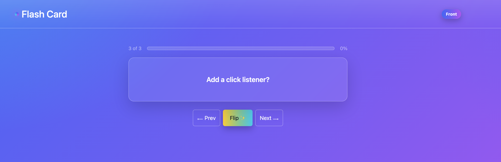

# 🧠 Flash Card — Interactive Study Deck (Bootstrap Edition)




---
Work with a partner to build an interactive flashcard app using **JavaScript** and **Bootstrap 5**.

## 🎯 User Story
> As a student, I want to flip through flashcards to study key concepts, view my progress, and make it visually engaging.

---

## ✅ Acceptance Criteria

* It’s done when clicking **Next** or **Prev** cycles through the cards (this part is pre-built).
* It’s done when clicking the **Flip** button or the card itself toggles between the front and back.
* It’s done when the **counter** and **progress bar** update to reflect the current position.
* It’s done when the **Front/Back badge** dynamically updates as cards are flipped.
* It’s done when students can replace the card data with their own content.

---

## 🧩 Starter Details

You’ve been provided:
* A **Bootstrap 5** layout with colorful styles.
* Working **Prev** and **Next** buttons.
* A card array (`cards[]`) to store front/back pairs.
* A partially complete `render()` function to update the UI.

---

## 💡 TODOs

Inside `script.js`, look for the following and complete them:

```js
// TODO: Update progress width (percent complete)
// TODO: Update side badge to "Front" / "Back"
// TODO: Flip behavior (click card or Flip button to toggle front/back)
// TODO: Keyboard shortcuts: ArrowRight, ArrowLeft, Space/Enter
```

You can test your work step-by-step by opening `index.html` in your browser and watching the card update.

---

## 🖌️ Style Challenges

Customize the interface to make it your own:
- Change the **color palette** in `:root` (CSS variables control gradients).
- Modify button colors, glow, or shadows.
- Add icons or emojis to your buttons (e.g., `✨ Flip ✨`).
- Replace the question deck with your own study topic — e.g., aviation terms, coding concepts, history facts, etc.

---

## 🏆 Bonus Challenges

If you finish early, try one or more of these enhancements:

1. **Shuffle Deck** — Add a "Shuffle" button that randomizes card order.
2. **Save Progress** — Store the last viewed card in `localStorage` so progress is remembered after refresh.
3. **Keyboard Control** — Add Arrow Left/Right navigation and Space/Enter to flip the card.
4. **Dark Mode Toggle** — Use Bootstrap’s `bg-dark` utilities or custom CSS to switch color schemes.
5. **Add/Remove Cards** — Let the user create or delete their own flashcards dynamically.

---

## 📘 Resources

* [Bootstrap 5 Documentation](https://getbootstrap.com/docs/5.3/getting-started/introduction/)
* [MDN addEventListener()](https://developer.mozilla.org/en-US/docs/Web/API/EventTarget/addEventListener)
* [MDN Keyboard Events](https://developer.mozilla.org/en-US/docs/Web/API/KeyboardEvent)
* [MDN localStorage](https://developer.mozilla.org/en-US/docs/Web/API/Window/localStorage)
