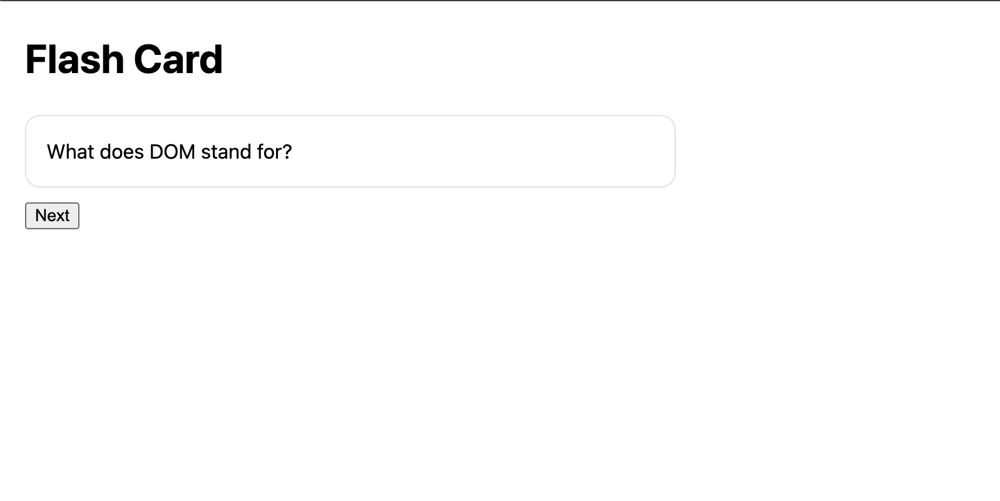

# 🃏 Flash Card — Beginner Challenge (Starter Included)




---

## 🎯 Goal

Create your own **Flash Card Viewer** that flips between front/back and cycles through multiple cards.  
You’ll **start from the provided working code** and **build on top of it** by adding your own questions, topics, styling, and bonus features.

---

## 🧠 Core Requirements

1. Use an **array of objects** to hold your flashcard data:
   ```js
   var cards = [
     { front: 'What does DOM stand for?', back: 'Document Object Model' },
     { front: 'Method to select one element?', back: 'document.querySelector' }
   ];
   ```
2. Show the **front** by default. Clicking the card flips it to the **back** (and back again).  
3. A **Next** button cycles through cards (wrap to the first after the last).  
4. Use **localStorage** to save and restore the current card index when the page reloads.

---

## 🧩 Build On Top of the Starter

You’ve been given working starter files: HTML, CSS, and JS.  
Your task is to **extend and personalize** them — not start from scratch.

### ✅ At Minimum:
- 🎨 Change the **topic/theme** of your flashcards (examples: Movies, Languages, Space, History, Music, Pokémon).  
- ✏️ Replace the questions/answers in the `cards` array with your own.  
- 💅 Improve the **CSS design** (fonts, colors, spacing, etc.).  
- 🔄 Add a **flip animation** (CSS `transform` or `transition`).  
- 📱 Make it **responsive** for both desktop and mobile.  

---

## 🌟 Bonus Features — Choose Your Adventure!

These are **optional stretch goals**, grouped by skill level.  
Try one from each level or climb your way up! 🧗‍♀️

### 🟢 Beginner
- Add a **Previous** button.  
- Display **“Card X of Y”** to track progress.  
- Add a **title** or **subtitle** showing your chosen topic.  
- Use **Google Fonts** to personalize your design.  

### 🟡 Intermediate
- Add a **Light/Dark Mode** toggle using CSS variables.  
- Include a **Shuffle Cards** button.  
- Save **user preferences** (theme or last viewed card) with `localStorage`.  
- Add **sound effects** when flipping or switching cards.  

### 🔵 Advanced
- Turn it into a **quiz mode** where users guess before flipping.  
- Track **scores** or **accuracy percentage**.  
- Add a **progress bar** or **visual indicator**.  
- Implement an **auto-play slideshow** (use `setInterval`).  
- Add **keyboard shortcuts** (Left/Right arrows to navigate).  

---

## 🧰 File Overview

| File | Description |
|------|--------------|
| `index.html` | The main page structure |
| `style.css` | Starter styling — expand it creatively! |
| `script.js` | Contains the working card logic |
| `README.md` | Instructions and goals (this file) |

---

## 🚀 Submission Checklist

Before submitting, make sure:
- [ ] You **changed the flashcard topic**.  
- [ ] You **added unique styling or animations**.  
- [ ] The **flip** and **next** features work properly.  
- [ ] You tested your project on both **desktop and mobile**.  
- [ ] You pushed your code to GitHub and deployed with **GitHub Pages**.

📤 Submit:
- **Repository URL**  
- **Live GitHub Pages URL**

---

## 📚 Recommended Resources

🎥 **Videos**
- [Traversy Media — JavaScript DOM Crash Course (10 min)](https://www.youtube.com/watch?v=0ik6X4DJKCc)  
- [Web Dev Simplified — Cookies vs Local Storage vs Session Storage](https://www.youtube.com/watch?v=GihQAC1I39Q)

📖 **Articles**
- [W3Schools — JavaScript HTML DOM](https://www.w3schools.com/js/js_htmldom.asp)  
- [MDN — Document Object Model (DOM)](https://developer.mozilla.org/en-US/docs/Web/API/Document_Object_Model)

---

## 🧑‍💻 Tip
Your creativity matters more than perfection — make it **look and feel like *your* app**.  
A fun, polished Flash Card app shows off your growing web dev skills. 🌈
