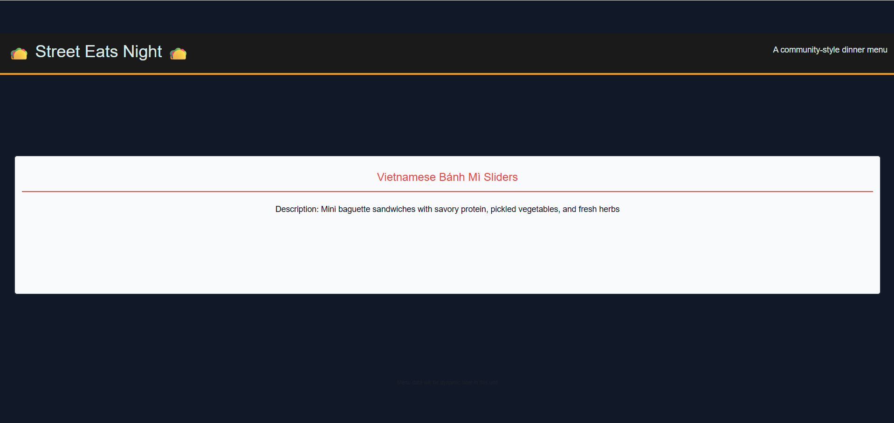

# 🏗️ Implement a GET Route for Food Item Descriptions

Work with your group to implement the following user story:

- As a site visitor, I want to view the description of a single food item when I visit  
  `http://localhost:3001/dish/:num`.

## Acceptance Criteria

- The `/dish/:num` route is configured to retrieve the correct food item based on the route parameter.
- The route passes the selected food item to a Handlebars view.
- The view displays the food item’s name and description.
- The food item shown matches the number provided in the URL.

## Assets

The following image demonstrates the expected behavior of the application:

---

## 💡 Hints

- Which controller file is responsible for handling this route?
- How do you pass data from a route into a Handlebars template?
- How can you ensure the correct template is rendered for this page?

## 🏆 Bonus

If you complete the core requirements, explore the following:

- How can an array of food items be rendered dynamically using Handlebars?
- What Handlebars features help avoid repeating markup?

Use a search engine or official documentation to research these concepts.
