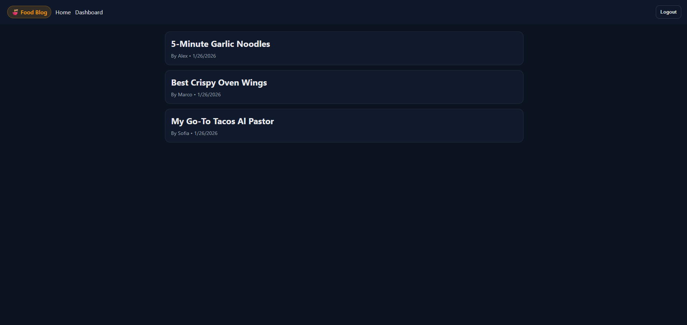

# 14 Model-View-Controller (MVC): Food Blog

## Overview

Writing about food can be just as creative and technical as cooking it. Food bloggers experiment with recipes, document techniques, review restaurants, and share cultural food stories.

In this project, you will build a **CMS-style Food Blog**, similar to a WordPress site, where users can publish food-related posts (recipes, reviews, cooking tips) and comment on other users’ posts.

The application will be built from scratch and deployed to Render. It will follow the **Model-View-Controller (MVC)** architectural pattern using Handlebars.js, Sequelize, Express, and session-based authentication.

---

## User Story

AS A food blogger  
I WANT a CMS-style food blog  
SO THAT I can publish recipes, food stories, and cooking tips and interact with other food enthusiasts

---

## Acceptance Criteria

- Homepage displays existing food posts, navigation links, and login option
- Users can sign up, log in, and maintain a session
- Logged-in users can create, edit, and delete their own posts
- Users can comment on posts while logged in
- Dashboard shows a user’s posts and a form to create new ones
- Logged-out users can view posts but cannot modify content
- Sessions expire after inactivity
- Views are rendered with Handlebars.js
- Application follows MVC architecture

---

## Mock-Up

---

## Getting Started

### 1. Install Dependencies

npm install

### 2. Environment Setup

Rename `.env.EXAMPLE` to `.env` and configure your database credentials.

### 3. Create the Database

Use PostgreSQL to create the database defined in your `.env` file.

### 4. Seed the Database (Optional)

If seed files are provided:

npm run seed

### 5. Start the Server

npm start

Navigate to: http://localhost:3001

---

## Project Structure

- models/ – Sequelize models and relationships
- views/ – Handlebars templates
- controllers/ – Route handlers and logic
- public/ – Client-side JavaScript and assets

---

## Grading Requirements

### Technical (40%)

- Meets all acceptance criteria
- Uses MVC architecture
- Uses Handlebars.js
- Deployed to Render

### Deployment (32%)

- Live URL
- No runtime errors
- GitHub repository submitted

### Application Quality (15%)

- Intuitive navigation
- Clean UI

### Repository Quality (13%)

- Unique name
- Clean structure
- Meaningful commits
- Quality README

---

## Submission

Submit:

- Deployed application URL
- GitHub repository URL
