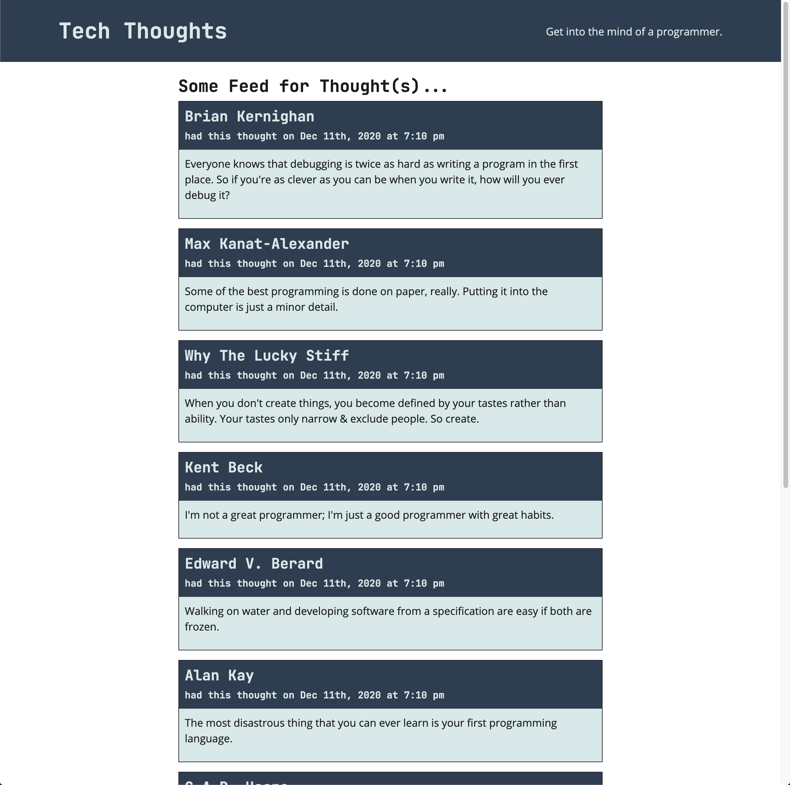

# 🏗️ Unit 19 – 14-Stu_useQuery - `useQuery` Homepage Feed (Thoughts)

### CodeAcademy | MERN + GraphQL Track

In this activity, you’ll connect the front end to our GraphQL API using Apollo Client’s `useQuery()` hook.

Your goal is to build a homepage feed that displays the latest thoughts from our database — the same way a real app loads content on first page load.

---

## 🎯 User Story

As a user,  
when I visit the homepage,  
I want to see a list of thoughts so I can quickly scan what people have posted.

---

## ✅ Acceptance Criteria

This activity is complete when:

- The homepage displays **all thought data** returned from the GraphQL API in a list.
- The homepage shows a **loading state** while the request is still in progress (before data returns).

---

## 🖼️ UI Reference

Use this screenshot as your target behavior:

---

## 💡 Hints

Use these questions to guide your implementation:

- Where should a GraphQL query live so it can be imported anywhere in the app?
- Which values returned from `useQuery()` help you detect:
  - loading state
  - successful response data
  - request errors
- If your list is empty, how can you seed the database so there’s data to query?

---

## 🧪 Bootcamp Reality Check

If you’re not seeing thoughts on the homepage:

- Confirm the backend is running and the GraphQL endpoint loads
- Seed the database (`npm run seed`)
- Verify your query matches the schema fields exactly
- Temporarily `console.log(data)` to confirm the response shape

---

## 🏆 Bonus Challenge

Apollo Client uses a Provider so the entire React app can access GraphQL features.

**Challenge:**  
What React API is Apollo Client’s Provider built with?

Use Google (or another search engine) and be ready to explain your answer in one sentence.

---

