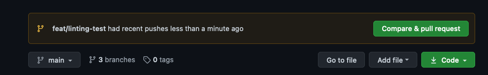
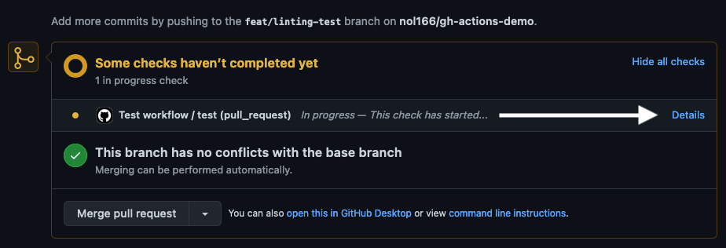
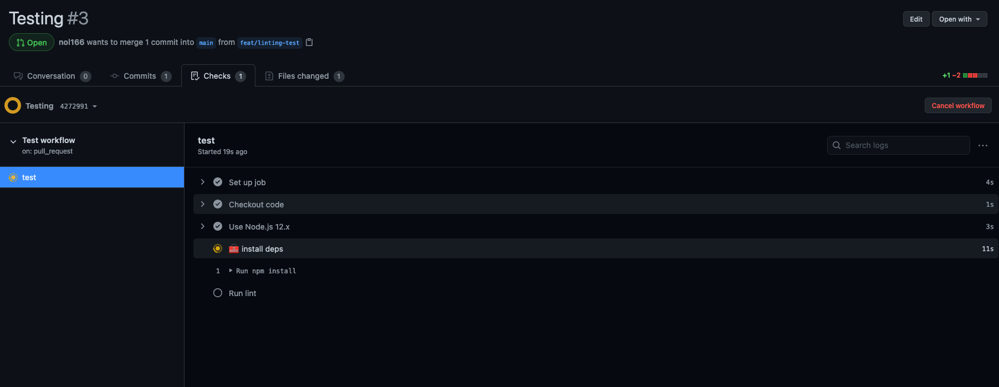
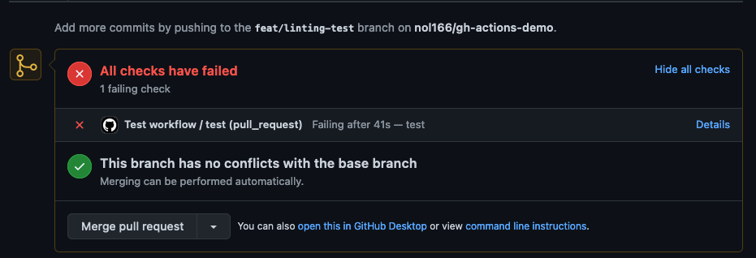

# ⚙️ GitHub Actions: Automated Linting for Pull Requests

### CodeAcademy – Unit 19 (MERN + GraphQL)

At this point in the course, you’ve been building full-stack MERN applications and collaborating using GitHub. In professional environments, teams automate quality checks instead of relying on memory.

In this lesson, you’ll configure **GitHub Actions** to automatically run ESLint whenever a Pull Request is opened against the `dev` or `main` branches.

---

## 📚 Before You Begin

If you are new to GitHub Actions, review:

https://docs.github.com/en/actions/learn-github-actions/introduction-to-github-actions

---

# 🚀 Initial Project Setup

We’ll start with a fresh React project using Vite.

## 1️⃣ Create the App

```bash
npm create vite@latest
```

- Project name: `gh-actions-demo`
- Framework: **React**
- Variant: **JavaScript**

Move into the project:

```bash
cd gh-actions-demo
npm install
```

---

## 2️⃣ Install ESLint

```bash
npm i eslint --save-dev
```

---

## 3️⃣ Update package.json Scripts

Open `package.json` and confirm your scripts include:

```json
"scripts": {
  "dev": "vite",
  "build": "vite build",
  "preview": "vite preview",
  "lint": "eslint src --ext js,jsx --report-unused-disable-directives --max-warnings 0"
}
```

Now you can run:

```bash
npm run lint
```

---

# 🌎 Push the Project to GitHub

## 1️⃣ Create a Repository

Create a new GitHub repository:

- Name: `gh-actions-demo`
- Do NOT initialize with README
- Do NOT add .gitignore

---

## 2️⃣ Connect Local Repo to GitHub

```bash
git init
git remote add origin git@github.com:USERNAME/gh-actions-demo.git
git branch -M main
git add -A
git commit -m "Initial commit"
git push -u origin main
```

---

# 🛠 Create the GitHub Actions Workflow

GitHub looks for workflow files inside:

```
.github/workflows/
```

Create the folder structure:

```bash
mkdir -p .github/workflows
touch .github/workflows/main.yml
```

Your structure should look like:

```
.github
└── workflows
    └── main.yml
```

---

# 🧠 Configure the Workflow

Open `.github/workflows/main.yml` and add:

```yaml
name: Lint workflow

on:
  pull_request:
    branches:
      - dev
      - main

jobs:
  lint:
    runs-on: ubuntu-latest

    steps:
      - name: Checkout code
        uses: actions/checkout@v4

      - name: Use Node.js 20.x
        uses: actions/setup-node@v4
        with:
          node-version: 20.x

      - name: Install dependencies
        run: npm install

      - name: Run ESLint
        run: npm run lint
```

---

## Commit the Workflow

```bash
git add .
git commit -m "Add GitHub Actions workflow"
git push origin main
```

---

# 🧪 Test the Workflow

Let’s intentionally trigger a lint failure.

## 1️⃣ Create a Feature Branch

```bash
git checkout -b feat/linting-test
```

---

## 2️⃣ Introduce a Lint Error

Open `src/App.jsx` and add:

```js
const App = 12;

function App() {
  return <h1>Hello World</h1>;
}
```

This redeclares `App` and should fail ESLint.

---

## 3️⃣ Push the Branch

```bash
git add .
git commit -m "Trigger lint failure"
git push origin feat/linting-test
```

---

## 4️⃣ Create a Pull Request

1. Go to GitHub
2. Click **Create Pull Request**
3. Open the PR details
4. Click **Details** on the workflow check






You should see the workflow fail ❌

---

# ✅ Why This Matters

This is your introduction to **Continuous Integration (CI)**.

Real teams automate:

- Linting
- Unit testing
- Type checking
- Build verification
- Deployment

GitHub Actions becomes part of your professional developer toolkit.

---

# 🎉 Conclusion

You’ve now:

- Created a GitHub Actions workflow
- Triggered it with a Pull Request
- Seen automated linting succeed/fail
- Built your first CI gate

Next upgrades you could try:

- Add `npm test`
- Add Prettier formatting checks
- Enable branch protection rules
- Deploy automatically on merge

Welcome to real-world DevOps.
