# 🚀 CI/CD with GitHub Actions and Render

In modern software development, applications are frequently updated with new features and bug fixes. To ensure these updates are delivered safely and efficiently, developers rely on **CI/CD pipelines**.

In this guide, you will learn how to set up a **GitHub Actions workflow** that automatically deploys a React application to **Render** after tests pass.

---

# 🧠 Key Concepts

### Continuous Integration (CI)

**Continuous Integration** is the practice of frequently merging code changes into a shared branch. Each merge triggers automated checks such as:

- running tests
- building the project
- verifying code quality

This helps teams detect issues early before they reach production.

### Continuous Deployment (CD)

**Continuous Deployment** automatically releases new versions of the application after the CI checks succeed.

Instead of manually deploying updates, the system handles it automatically.

### CI/CD Pipeline

A **CI/CD pipeline** connects these steps together:

```
Developer Push → Run Tests → Build App → Deploy Application
```

This workflow ensures that only **working code** gets deployed.

---

# 🏗 Step 1 — Create the Application

First we will create a small React app that will eventually be deployed automatically.

Create a new Vite React project:

```
npm create vite@4.4.1 github-cd
cd github-cd
```

Next:

1. Create a new repository on GitHub named **github-cd**
2. Do **not** initialize it with a README or `.gitignore`

Initialize git locally:

```
git init
```

Add the GitHub remote repository:

```
git remote add origin <github_repo_url>
```

Commit and push the project:

```
git add -A
git commit -m "Initial project"
git push -u origin main
```

---

# ☁️ Step 2 — Deploy the App to Render

Render allows us to host web applications and automatically deploy updates from GitHub.

### Create a Static Site

Click **New + → Static Site**

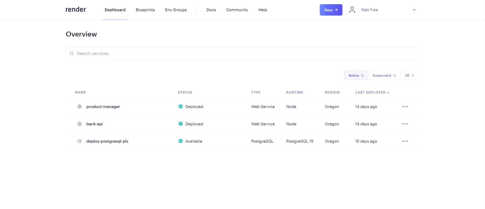

Select **Static Site**.

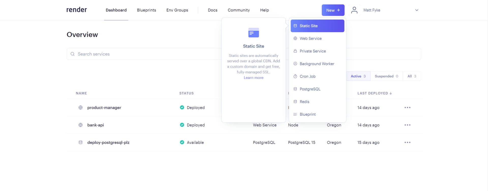

Connect your GitHub repository.

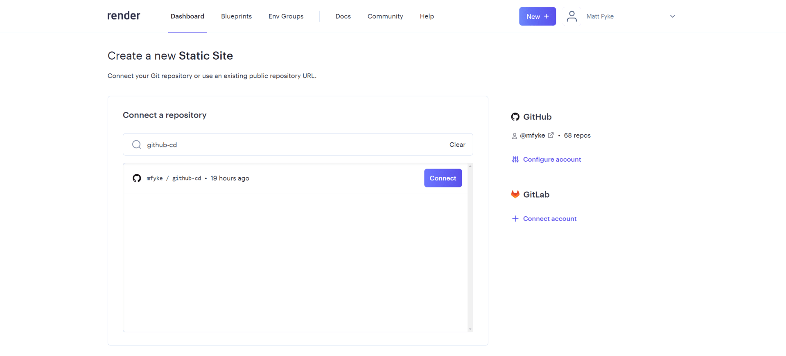

If this is your first time using Render, you will need to connect your GitHub account.

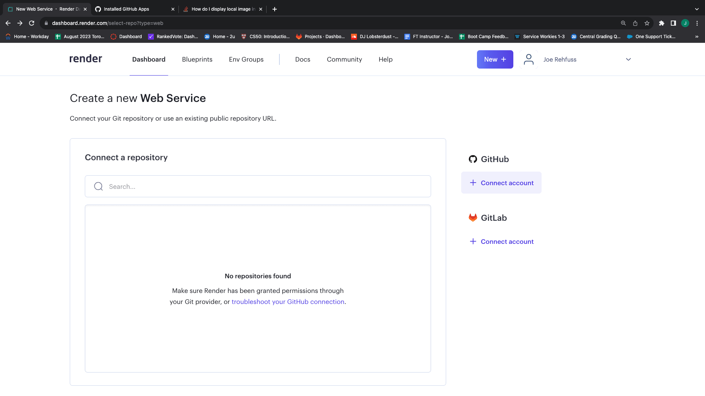

Grant Render access to your repositories.

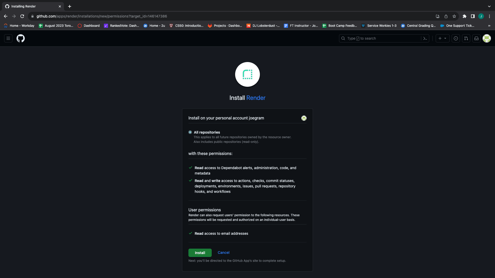

---

### Configure the Render Build

Give your app a name (matching the repo is helpful).

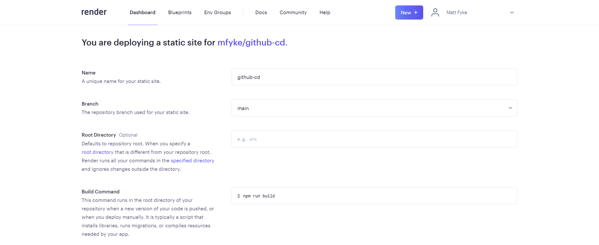

Set the following values:

Build Command

```
npm run build
```

Publish Directory

```
dist
```

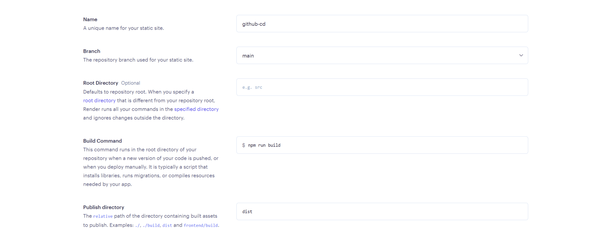

Click **Create Static Site**.

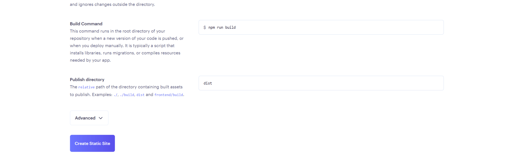

Once the deploy finishes, you will see a **live URL**.

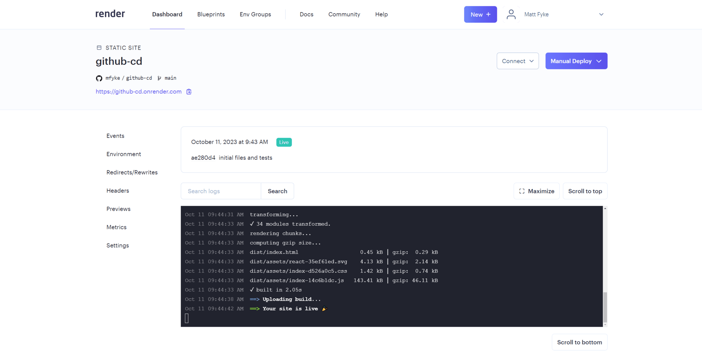

---

# 🔁 Test Render Auto Deploy

By default, Render redeploys your application when you push code to GitHub.

Verify the **Auto Deploy** setting:

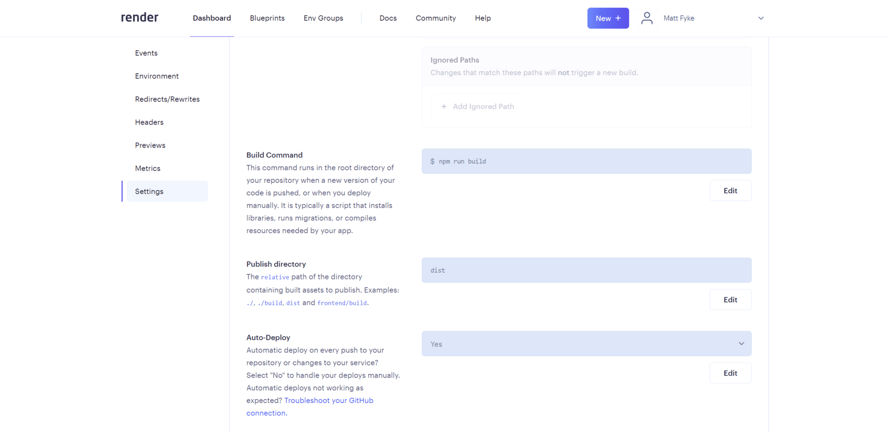

Try it:

1. Change the `h1` text in your app
2. Commit and push the change

```
git add -A
git commit -m "Test auto deploy"
git push
```

Render should redeploy automatically.

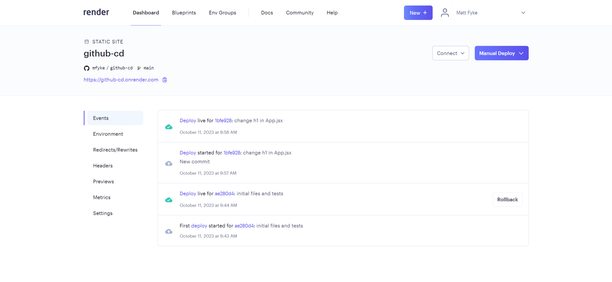

---

# ⚠️ Why Auto Deploy Can Be Risky

Right now **every push to main deploys immediately**.

This means:

- broken code could reach production
- failing builds could deploy
- bugs could appear on the live site

To prevent this, we will add **automated testing with GitHub Actions**.

---

# 🧪 Step 3 — Add a Test

Add a test script to `package.json`.

```
"scripts": {
  "test": "vitest"
}
```

Install testing dependencies:

```
npm i -D @testing-library/react happy-dom vitest
```

Update `vite.config.js`:

```js
test: {
  globals: true,
  environment: 'happy-dom',
  setupFiles: './src/tests/setup.js'
}
```

Create a test file:

```
src/tests/App.test.jsx
```

Add the following test:

```js
import { render } from "@testing-library/react";
import App from "../App";

it("renders with the h1 content as Deploy to Render", () => {
  render(<App />);

  const h1 = document.querySelector("h1");
  expect(h1.textContent).toBe("Deploy to Render");
});
```

Create the test setup file:

```
src/tests/setup.js
```

```js
import { afterEach } from "vitest";
import { cleanup } from "@testing-library/react";

afterEach(() => {
  cleanup();
});
```

Run the tests:

```
npm run test
```

The test should **fail initially**.

---

# ⚙️ Step 4 — Create the GitHub Actions Workflow

Create the workflow folder:

```
mkdir .github
mkdir .github/workflows
```

Create the workflow file:

```
.github/workflows/main.yml
```

Add the following workflow:

```yml
on:
  push:
    branches: [main]

jobs:
  ci:
    runs-on: ubuntu-latest

    steps:
      - uses: actions/checkout@v4

      - name: Install and Test
        run: |
          npm install
          npm run test

      - name: Deploy
        if: github.ref == 'refs/heads/main'
        env:
          deploy_url: ${{ secrets.RENDER_DEPLOY_HOOK_URL }}
        run: |
          curl "$deploy_url"
```

---

# 📦 What This Workflow Does

Whenever code is pushed to `main`:

1. GitHub spins up a **Linux container**
2. The repository is downloaded
3. Dependencies are installed
4. Tests run
5. If tests pass → deployment is triggered

---

# 🔐 Step 5 — Add Render Deploy Hook

In Render:

Disable **Auto Deploy**.

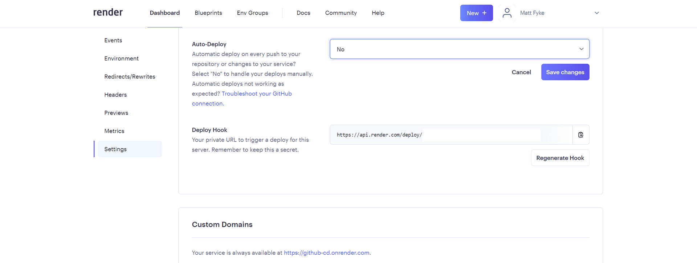

Copy the **Deploy Hook URL**.

---

# 🔑 Step 6 — Add GitHub Secret

Go to:

Repository → **Settings → Secrets → Actions**

Click **New repository secret**.

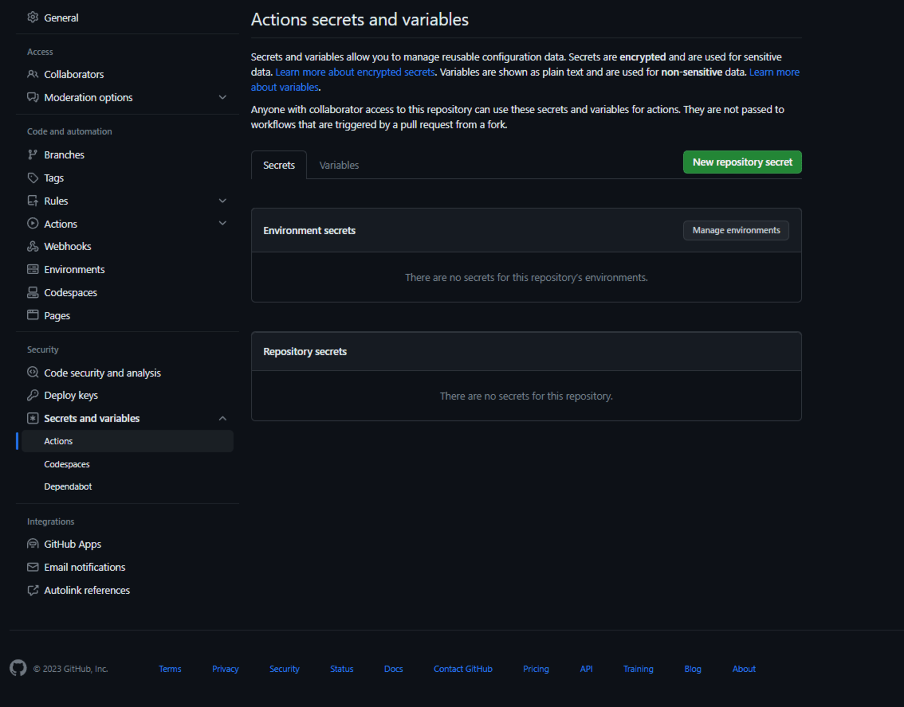

Create:

Name

```
RENDER_DEPLOY_HOOK_URL
```

Value

```
<your render deploy hook>
```

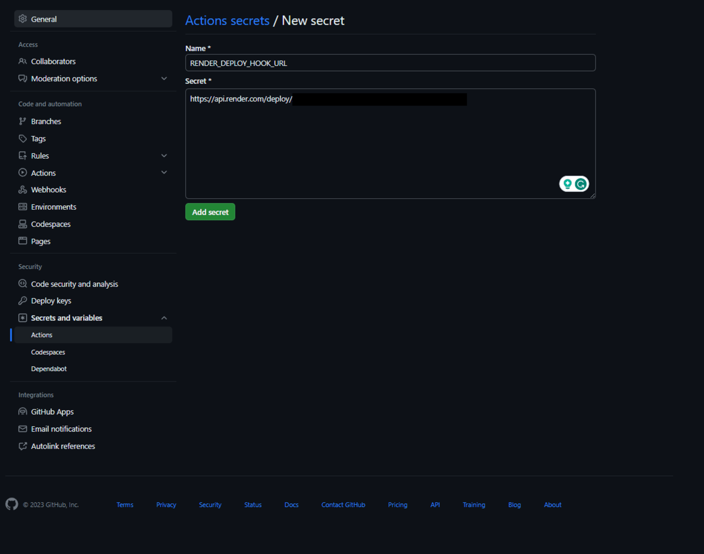

---

# 🧪 Step 7 — Test the Pipeline

Commit your changes.

```
git add -A
git commit -m "Add CI workflow"
git push origin main
```

The workflow should run but **fail** because the test fails.

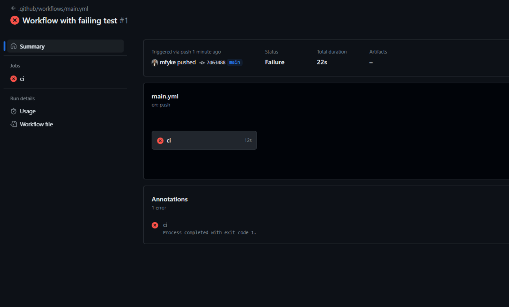

---

# ✅ Fix the Test

Update your `App.jsx`:

```
<h1>Deploy to Render</h1>
```

Commit again:

```
git add -A
git commit -m "Fix test"
git push origin main
```

Now:

- tests pass
- deployment runs automatically

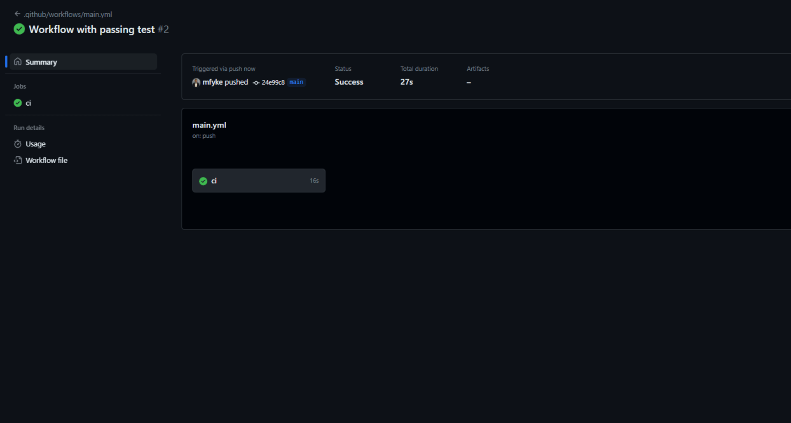

You should also see a deploy in Render.

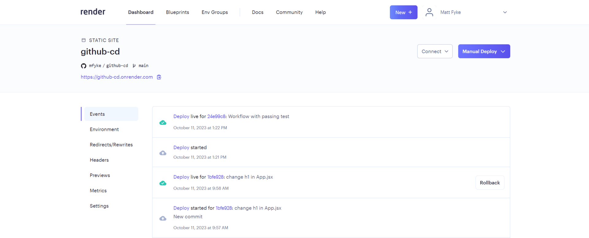

---

# 🎉 Conclusion

You have successfully built a **CI/CD pipeline**.

Your workflow now:

```
Push Code
   ↓
Run Tests (CI)
   ↓
Deploy to Render (CD)
```

This ensures that **only working code reaches production**.

Understanding CI/CD pipelines is an important skill used in nearly every professional development environment.

---

# 📚 Helpful Resources

YAML documentation  
https://yaml.org/

GitHub Actions documentation  
https://docs.github.com/en/actions

CI overview  
https://docs.github.com/en/actions/guides/about-continuous-integration

Render deploy hooks  
https://render.com/docs/deploy-hooks
