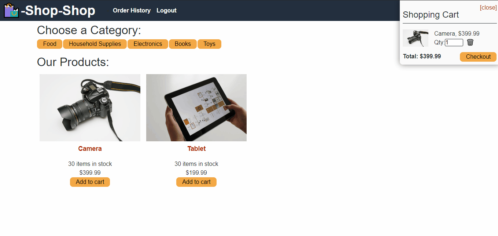

# ⭐ Extra Credit Project — Refactor Global State with Redux

In this optional challenge, you will refactor an existing e-commerce application so that it manages global state using **Redux** instead of the **React Context API**.

Redux has long been a standard solution for managing complex state in large React applications. Even though modern React includes powerful tools like Context and Hooks, Redux is still widely used in production applications and many companies rely on it.

This project will give you hands-on experience working with Redux in a real application.

---

# 🎯 Project Objective

Refactor the e-commerce application from the previous activity so that **Redux handles all global state instead of the Context API**.

Your goal is to implement Redux **without breaking the existing functionality** of the application.

---

# 🧠 What You’re Practicing

This project will help you practice:

- implementing a **Redux store**
- connecting React components with **react-redux**
- using **reducers** to manage application state
- dispatching actions through Redux
- refactoring an existing application while preserving functionality
- reading and applying documentation independently

---

# 💼 On the Job

Professional developers frequently need to learn new tools by reading documentation and experimenting with existing code.

In many cases there is **no tutorial** for the exact problem they are solving.

This assignment simulates that real-world workflow. You will use the **Redux documentation** to guide your implementation.

---

# 📦 Starting Code

Download the e-commerce application from the earlier activity:

```
01-Activities/26-Stu_Actions-Reducers/Unsolved
```

This project currently manages global state using **React Context**.

Your job is to replace that implementation with **Redux**.

---

# 👤 User Story

```
AS a developer working on an e-commerce platform
I WANT to use Redux to manage global state
SO THAT the application can scale and manage complex state more reliably
```

---

# ✅ Acceptance Criteria

Your refactor is complete when the following conditions are met:

### Redux Store

- The application uses a **Redux store** instead of the Context API.
- The store is created using Redux.

### Redux Provider

- The React application is wrapped in a **Redux Provider**.
- Components access global state through Redux.

### Reducers

- State updates are handled through **reducers**.
- The store receives reducers instead of relying on Context state.

### Dispatching Actions

- Components dispatch actions using Redux.
- State changes are calculated by reducers.

### State Access

- Components read global state from the Redux store.

### Application Functionality

The application should behave **exactly the same as before**:

- product browsing works
- categories filter correctly
- cart functionality works
- checkout flow works

---

# 🖥 Application Overview

The application includes the following features:

### User Signup

Users can create an account and access the product catalog.


---

### Product Browsing

Users can:

- select categories
- view product details
- add items to the cart


---

### Checkout

Users can proceed to checkout from their shopping cart.



---

# 📚 Helpful Documentation

Redux Fundamentals Guide  
https://redux.js.org/tutorials/fundamentals/part-1-overview

Redux Documentation  
https://redux.js.org/

Stripe Testing Documentation  
https://stripe.com/docs/testing

---

# 💡 Implementation Tips

- Start by creating the **Redux store**
- Wrap the application with the **Redux Provider**
- Replace Context logic with Redux state access
- Convert Context state updates into **Redux actions and reducers**

Remember: the UI should continue working exactly the same after the refactor.

---

# 🚀 Deployment Requirement

Your completed application must be deployed online.

Recommended hosting platforms:

- Render
- Netlify
- Vercel

---

# 📊 Grading Criteria

### Technical Requirements (40%)

- Redux store replaces Context API
- reducers manage global state
- actions dispatch correctly
- application functionality remains intact
- application successfully deployed

---

### Deployment (32%)

- live application URL submitted
- application loads without errors
- GitHub repository submitted
- repository contains complete application code

---

### Application Quality (15%)

- application is easy to use
- interface is clean and organized
- functionality matches the provided demo

---

### Repository Quality (13%)

- repository has a unique name
- clear folder structure
- descriptive commit messages
- clean and readable code
- high-quality README with screenshots and deployed link

---

# 📥 Submission Requirements

Submit the following:

1. The URL of the **deployed application**
2. The URL of the **GitHub repository**

Your repository should include:

- the full application code
- a README describing the project
- instructions for running the app locally

---

# ⭐ Final Note

This assignment is **optional extra credit**. Completing it will give you additional practice with Redux and may earn bonus points.

Even if you choose not to submit it, the exercise is highly recommended if you want deeper experience with **real-world React state management**.
